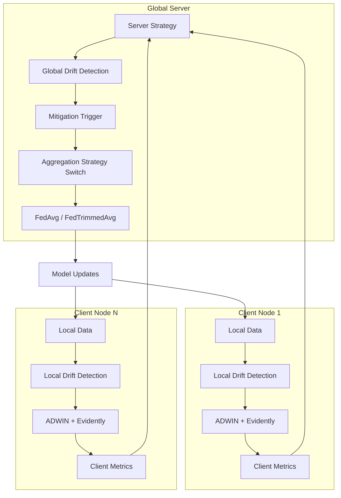
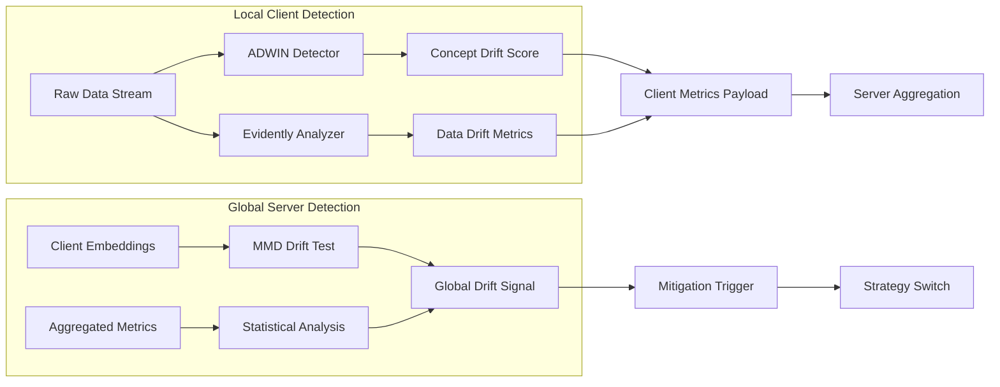
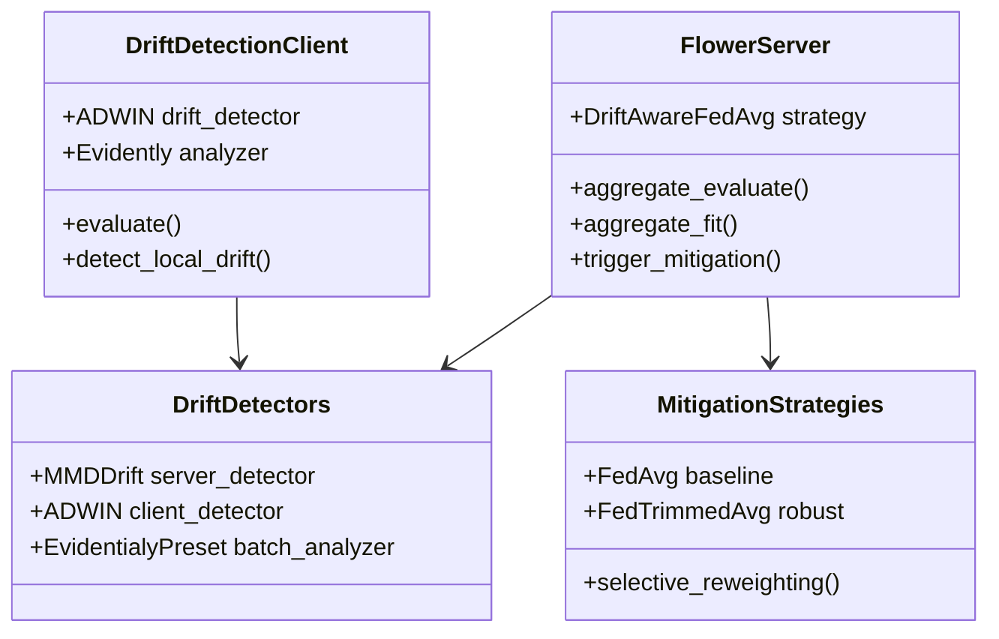
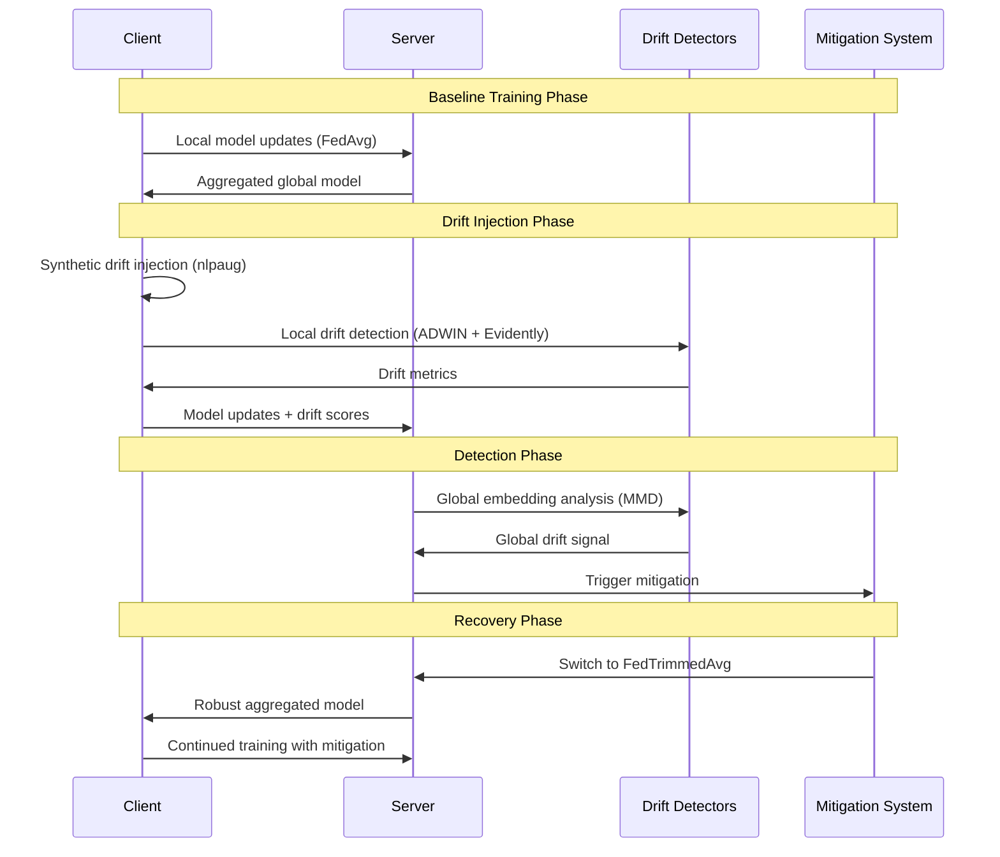
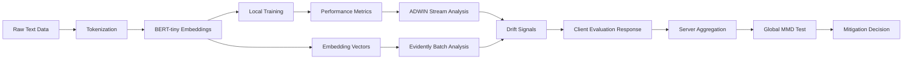

# Federated LLM Drift Detection and Recovery System

## Overview

A reproducible pipeline for detecting and recovering from data drift in federated Large Language Model (LLM) deployments across distributed nodes. The system addresses the challenge where input data from distributed clients gradually diverges due to evolving local patterns (new dialects, changing clinical notes, emerging usage patterns), resulting in degraded accuracy and inconsistent outputs.

**Core Problem:** LLMs in federated settings face data drift challenges that lead to:
- Degraded model accuracy over time
- Inconsistent outputs across different clients
- Reduced trust in the federated system
- Performance degradation without manual intervention

**Solution Approach:** Multi-level drift detection and automated recovery mechanisms using:
- Local client-level drift detection (statistical tests, embedding divergence)
- Global aggregation-level monitoring (token distribution analysis)
- Automated mitigation strategies (selective re-weighting, adaptive aggregation)
- Self-healing drift-aware framework for long-term reliability

## Technology Stack & Dependencies

### Core Framework Stack
- **Federated Learning:** Flower (flwr) with simulation support
- **LLM Framework:** Hugging Face Transformers with PyTorch
- **Drift Detection:** Alibi Detect, Evidently, River
- **Data Processing:** Datasets, scikit-learn, nlpaug
- **Platform:** macOS with Apple Silicon (MPS) support

### Dependency Matrix
| Component | Library | Version | Purpose |
|-----------|---------|---------|---------|
| Federation | flwr[simulation] | Latest | Client orchestration, aggregation |
| ML Framework | torch, transformers | Latest | Model training, inference |
| Drift Detection | alibi-detect | Latest | Server-side embedding drift (MMD) |
| Stream Detection | river | Latest | Client-side concept drift (ADWIN) |
| Batch Analysis | evidently | Latest | Client-side data drift reports |
| Data Augmentation | nlpaug | Latest | Synthetic drift injection |
| Dataset Management | datasets | Latest | Text dataset loading and partitioning |

## Architecture

### System Architecture Overview



### Multi-Level Drift Detection Architecture



### Component Hierarchy



## Data Flow Between Layers

### End-to-End Pipeline Flow



### Data Processing Pipeline



## Implementation Methodology

### Step 1: Environment Setup (macOS)

**Virtual Environment Creation:**
```bash
python3 -m venv venv && source venv/bin/activate
```

**Dependency Installation:**
```bash
pip install "flwr[simulation]" "transformers[torch]" datasets torch torchvision torchaudio alibi-detect evidently river nlpaug scikit-learn
```

**Project Scaffolding:**
```bash
flwr new fl-drift-demo --template full-stack-huggingface
cd fl-drift-demo
```

### Step 2: Data Preparation & Synthetic Drift Injection

**Dataset Configuration:**
- Primary Dataset: AG News (4-class text classification)
- Partition Strategy: Dirichlet partitioner for non-IID distribution
- Client Count: 10-12 simulated clients
- Drift Injection Points: Round 25 of 50 total rounds

**Drift Injection Strategies:**

| Drift Type | Method | Implementation | Target Clients |
|------------|--------|----------------|----------------|
| Topic/Vocab Shift | nlpaug synonym replacement | Word-level augmentation | 2-3 clients |
| Concept Drift | Label noise injection | 20% label flipping | 3-4 clients |
| Distribution Shift | Class imbalance | Selective sampling | 2 clients |

**Data Partition Architecture:**
```python
# Non-IID partitioning using Dirichlet distribution
flwr_datasets.partitioner.DirichletPartitioner(
    num_partitions=10,
    partition_by="label",
    alpha=0.5  # Controls heterogeneity level
)
```

### Step 3: Federated Training Simulation Configuration

**Model Specification:**
- Base Model: `prajjwal1/bert-tiny` (lightweight transformer)
- Task: Text classification with 4 classes
- Training: Local SGD with server aggregation

**Simulation Parameters:**
```toml
[tool.flwr.run.simulation]
num_supernodes = 10
num_rounds = 50
num_gpus = 0.25  # MPS acceleration for Apple Silicon
```

**Training Configuration:**
- Learning Rate: 2e-5
- Batch Size: 16
- Local Epochs: 3
- Aggregation: FedAvg → FedTrimmedAvg (post-drift)

### Step 4: Multi-Level Drift Detection Implementation

#### Local Client-Side Detection

**Method 1: Concept Drift Detection**
```python
# ADWIN drift detector for performance monitoring
from river.drift import ADWIN

class DriftDetectionClient:
    def __init__(self):
        self.drift_detector = ADWIN(delta=0.002)
        self.reference_data = None
    
    def evaluate(self, parameters, config):
        # Standard evaluation
        loss, accuracy = self.local_evaluate()
        
        # ADWIN concept drift detection
        self.drift_detector.update(loss)
        concept_drift = self.drift_detector.detected_change()
        
        return loss, num_examples, {
            'accuracy': accuracy,
            'adwin_drift': concept_drift,
            'loss': loss
        }
```

**Method 2: Data Drift Detection**
```python
# Evidently data drift analysis
from evidently.report import Report
from evidently.metric_preset import DataDriftPreset

def detect_data_drift(reference_data, current_data):
    report = Report(metrics=[DataDriftPreset()])
    report.run(reference_data=reference_data, current_data=current_data)
    
    result = report.as_dict()
    psi_score = result['metrics'][0]['result']['dataset_drift']
    
    return {
        'psi': psi_score,
        'data_drift_detected': psi_score > 0.25
    }
```

#### Global Server-Side Detection

**Embedding Drift Detection:**
```python
# MMD drift test for high-dimensional embeddings
from alibi_detect.cd import MMDDrift

class DriftAwareStrategy(FedAvg):
    def __init__(self, *args, **kwargs):
        super().__init__(*args, **kwargs)
        self.reference_embeddings = None
        self.mmd_detector = None
    
    def aggregate_evaluate(self, server_round, results, failures):
        # Collect client embeddings
        client_embeddings = self.extract_embeddings(results)
        
        if server_round == 1:
            # Set reference embeddings from first round
            self.reference_embeddings = client_embeddings
            self.mmd_detector = MMDDrift(
                self.reference_embeddings,
                p_val=0.05
            )
        else:
            # Test for drift
            drift_result = self.mmd_detector.predict(client_embeddings)
            global_drift = drift_result['data']['is_drift']
            
            if global_drift:
                self.trigger_mitigation()
        
        return super().aggregate_evaluate(server_round, results, failures)
```

### Step 5: Automatic Mitigation Trigger & Recovery

**Trigger Logic Implementation:**
```python
def should_trigger_mitigation(self, server_round, client_results):
    # Global drift detection
    global_drift = self.detect_global_drift()
    
    # Client quorum check
    drift_reports = [r.metrics.get('adwin_drift', False) for _, r in client_results]
    client_drift_ratio = sum(drift_reports) / len(drift_reports)
    
    # Trigger conditions
    return (
        global_drift or  # MMD test detects drift
        client_drift_ratio > 0.3  # >30% clients report drift
    )
```

**Recovery Strategy Implementation:**
```python
class AdaptiveStrategy(FedAvg):
    def __init__(self, *args, **kwargs):
        super().__init__(*args, **kwargs)
        self.mitigation_active = False
        self.trimmed_strategy = FedTrimmedAvg(beta=0.2)
    
    def aggregate_fit(self, server_round, results, failures):
        if self.mitigation_active:
            # Use robust aggregation
            return self.trimmed_strategy.aggregate_fit(server_round, results, failures)
        else:
            # Use standard FedAvg
            return super().aggregate_fit(server_round, results, failures)
```

## Testing Strategy

### Unit Testing Framework

**Test Categories:**
1. **Drift Detection Tests**
   - ADWIN sensitivity validation
   - MMD statistical power testing
   - Evidently report generation verification

2. **Mitigation Strategy Tests**
   - FedTrimmedAvg convergence validation
   - Client re-weighting accuracy tests
   - Strategy switching logic verification

3. **Integration Tests**
   - End-to-end pipeline execution
   - Multi-client simulation stability
   - Performance metric collection validation

**Test Implementation Structure:**
```python
class TestDriftDetection(unittest.TestCase):
    def test_adwin_concept_drift(self):
        # Validate ADWIN detects known concept changes
        detector = ADWIN(delta=0.002)
        # Feed stable then drifted data
        # Assert drift detection
    
    def test_mmd_embedding_drift(self):
        # Validate MMD detects embedding distribution changes
        # Generate reference and drifted embedding sets
        # Assert p-value < threshold
    
    def test_evidently_data_drift(self):
        # Validate Evidently detects data distribution changes
        # Generate reference and drifted datasets
        # Assert PSI score exceeds threshold

class TestMitigationStrategies(unittest.TestCase):
    def test_fedtrimmedavg_robustness(self):
        # Validate robust aggregation under drift
        # Simulate clean and drifted client updates
        # Assert improved convergence
```

### Evaluation Metrics & Experiment Design

**Core Evaluation Metrics:**

| Metric | Formula | Purpose | Target |
|--------|---------|---------|--------|
| Global Accuracy | `(ΣTP + ΣTN) / Total` | Overall performance | >85% |
| Fairness Gap | `max(acc) - min(acc)` | Client disparity | <15% |
| Detection Delay | `Round(detect) - Round(inject)` | Response time | ≤3 rounds |
| Recovery Rate | `(Acc_recover - Acc_drift) / (Acc_base - Acc_drift)` | Mitigation effectiveness | ≥80% |
| Communication Overhead | `Rounds × Bytes_per_update` | Efficiency | <2x baseline |

**Experimental Protocol:**

```mermaid
gantt
    title Federated Drift Detection Experiment Timeline
    dateFormat X
    axisFormat %d
    
    section Baseline
    Stable Training (FedAvg)    :1, 9
    
    section Drift Injection
    Data Drift Injection        :10, 10
    
    section Detection
    Drift Detection Phase       :11, 13
    
    section Recovery
    Mitigation Activation       :14, 25
    
    section Validation
    Second Drift + Recovery     :26, 50
```



**Acceptance Criteria:**

| Phase | Rounds | Criteria | Pass/Fail Threshold |
|-------|--------|----------|-------------------|
| Baseline | 1-9 | Stable accuracy | Acc > 80% |
| Drift Impact | 10-13 | Performance drop | 5-15% accuracy loss |
| Detection | 11-13 | Drift detection | p < 0.05 within 3 rounds |
| Recovery | 14-25 | Accuracy restoration | ≥80% recovery within 10 rounds |
| Re-detection | 27-29 | Second drift detection | p < 0.05 within 3 rounds |

## Configuration Management

### Environment Configuration

**Development Environment:**
```bash
# Virtual environment setup
python3 -m venv fl_env
source fl_env/bin/activate

# Core dependencies
pip install flwr[simulation]==1.7.0
pip install torch==2.1.0 torchvision torchaudio
pip install transformers==4.35.0 datasets==2.14.0
pip install alibi-detect==0.11.4 evidently==0.4.15
pip install river==0.19.0 nlpaug==1.1.11
```

**Hardware Requirements:**
- macOS 12.0+ (Intel or Apple Silicon)
- 8GB RAM minimum, 16GB recommended
- 10GB free disk space
- Python 3.8-3.11

### Simulation Configuration

**Flower Simulation Settings:**
```toml
[tool.flwr.run.simulation]
num_supernodes = 10
num_rounds = 50
num_cpus = 4
num_gpus = 0.25  # MPS fraction for Apple Silicon

[tool.flwr.run.simulation.client_resources]
num_cpus = 2
num_gpus = 0.1
```

**Model Configuration:**
```python
MODEL_CONFIG = {
    'model_name': 'prajjwal1/bert-tiny',
    'max_length': 128,
    'batch_size': 16,
    'learning_rate': 2e-5,
    'num_epochs': 3,
    'warmup_steps': 100
}

DRIFT_CONFIG = {
    'injection_round': 25,
    'drift_intensity': 0.3,
    'affected_clients': [2, 5, 8],
    'drift_types': ['vocab_shift', 'label_noise']
}
```

### Logging and Monitoring

**Metrics Collection:**
```python
METRICS_CONFIG = {
    'log_file': 'drift_detection_results.csv',
    'metrics_to_track': [
        'global_accuracy',
        'fairness_gap',
        'drift_detection_rate',
        'recovery_effectiveness',
        'communication_overhead'
    ],
    'visualization': True,
    'real_time_plotting': False
}
```

**Output Structure:**
```
fl-drift-demo/
├── results/
│   ├── metrics_log.csv
│   ├── drift_detection_timeline.json
│   └── plots/
│       ├── accuracy_over_time.png
│       ├── fairness_gap_evolution.png
│       └── drift_detection_heatmap.png
├── logs/
│   ├── server.log
│   └── client_*.log
└── checkpoints/
    ├── round_10_baseline.pth
    ├── round_25_post_drift.pth
    └── round_50_recovered.pth
```


