# Research Paper Diagrams - Mermaid Code
# Federated Learning Drift Detection System

This file contains publication-ready Mermaid diagrams for your research paper.
Each diagram is self-contained and can be rendered in markdown viewers or converted to images.

**How to Use**:
1. Copy the Mermaid code block
2. Paste into Mermaid Live Editor (https://mermaid.live/)
3. Export as PNG/SVG for your paper
4. Or include directly in markdown-based papers

---

## Diagram 1: System Architecture Overview

### High-Level Federated System Architecture

```mermaid
graph TB
    subgraph "Federated Learning System"
        Server[Central Server<br/>DriftAwareFedAvg Strategy]

        subgraph "Server Components"
            MMD[Global MMD<br/>Drift Detector]
            Trigger[Mitigation<br/>Trigger Logic]
            Agg{Aggregation<br/>Strategy}
        end

        Server --> MMD
        Server --> Trigger
        Server --> Agg

        Agg -->|Normal| FedAvg[FedAvg<br/>Weighted Mean]
        Agg -->|Drift Detected| FedTrim[FedTrimmedAvg<br/>β=0.2 Trimming]

        subgraph "Client Layer"
            C0[Client 0]
            C1[Client 1]
            Cn[Client N-1]
        end

        Server <-->|Parameters<br/>& Metrics| C0
        Server <-->|Parameters<br/>& Metrics| C1
        Server <-->|Parameters<br/>& Metrics| Cn

        subgraph "Client 0 Components"
            M0[BERT-tiny<br/>Classifier]
            D0[Multi-Level<br/>Drift Detector]
            M0 --> D0
        end

        C0 --> M0

        subgraph "Drift Detection"
            ADWIN[ADWIN<br/>Concept Drift]
            Evid[Evidently<br/>Data Drift]
            MMDLocal[MMD Local<br/>Embedding Drift]
        end

        D0 --> ADWIN
        D0 --> Evid
        D0 --> MMDLocal
    end

    style Server fill:#e1f5ff
    style MMD fill:#fff4e1
    style FedAvg fill:#e8f5e9
    style FedTrim fill:#ffebee
    style ADWIN fill:#f3e5f5
    style Evid fill:#f3e5f5
    style MMDLocal fill:#f3e5f5
```



**Figure 1**: High-level architecture showing the hierarchical drift detection system with client-side local detectors (ADWIN, Evidently, MMD) and server-side global drift detector, along with adaptive aggregation strategy switching.

---

## Diagram 2: Federated Learning Round Flow

### Complete Round Execution Sequence

```mermaid
sequenceDiagram
    participant S as Server
    participant C0 as Client 0
    participant C1 as Client 1
    participant CN as Client N-1

    Note over S: Round t begins

    S->>C0: Broadcast global model wᵗ
    S->>C1: Broadcast global model wᵗ
    S->>CN: Broadcast global model wᵗ

    par Client Training
        C0->>C0: Set parameters wᵗ
        C0->>C0: Train E epochs
        C0->>C0: Extract embeddings
        C0->>C0: Detect local drift
    and
        C1->>C1: Set parameters wᵗ
        C1->>C1: Train E epochs
        C1->>C1: Extract embeddings
        C1->>C1: Detect local drift
    and
        CN->>CN: Set parameters wᵗ
        CN->>CN: Train E epochs
        CN->>CN: Extract embeddings
        CN->>CN: Detect local drift
    end

    C0->>S: Upload wᵗ⁺¹₀ + embeddings + drift signals
    C1->>S: Upload wᵗ⁺¹₁ + embeddings + drift signals
    CN->>S: Upload wᵗ⁺¹ₙ + embeddings + drift signals

    Note over S: Aggregation Phase

    S->>S: Collect all embeddings
    S->>S: Global MMD drift test
    S->>S: Check client quorum

    alt Drift Detected
        S->>S: Activate mitigation
        S->>S: FedTrimmedAvg(wᵗ⁺¹₀, ..., wᵗ⁺¹ₙ)
    else No Drift
        S->>S: FedAvg(wᵗ⁺¹₀, ..., wᵗ⁺¹ₙ)
    end

    Note over S: Evaluation Phase

    S->>C0: Broadcast updated model
    S->>C1: Broadcast updated model
    S->>CN: Broadcast updated model

    par Client Evaluation
        C0->>C0: Evaluate on test data
        C1->>C1: Evaluate on test data
        CN->>CN: Evaluate on test data
    end

    C0->>S: Report accuracy
    C1->>S: Report accuracy
    CN->>S: Report accuracy

    S->>S: Calculate global accuracy (weighted)
    S->>S: Calculate fairness metrics
    S->>S: Store performance history

    Note over S: Round t complete
```



**Figure 2**: Sequence diagram illustrating the complete federated learning round flow, including parameter broadcast, client training with drift detection, server aggregation with adaptive strategy selection, and evaluation metric collection.

---

## Diagram 3: Multi-Level Drift Detection Pipeline

### Three-Dimensional Drift Detection Architecture


**Figure 3**: Multi-level drift detection pipeline showing three-dimensional drift coverage (concept, data, embedding) with hierarchical client-server architecture and dual-trigger mitigation system.

---

## Diagram 4: Data Flow and Drift Injection Timeline

### Experimental Timeline with Drift Injection


**Figure 4**: Gantt chart showing the experimental timeline across 50 rounds, illustrating the progression from baseline training through drift injection, detection, mitigation activation, and recovery phases.

---

## Diagram 5: FedTrimmedAvg Aggregation Algorithm

### Robust Aggregation with Trimming

```mermaid
flowchart TD
    Start([Start: Server receives<br/>N client updates]) --> Extract[Extract parameters<br/>and weights from each client]

    Extract --> Loop{For each<br/>layer l}

    Loop --> Collect[Collect layer l parameters<br/>from all N clients]

    Collect --> Weight[Calculate weighted parameters:<br/>weighted_i = params_i × weight_i]

    Weight --> Norm[Calculate parameter norms:<br/>norm_i = ||weighted_i||₂]

    Norm --> Sort[Sort clients by norm:<br/>sorted_indices = argsort(norms)]

    Sort --> Trim[Trim extremes:<br/>Remove β×N smallest<br/>Remove β×N largest]

    Trim --> Keep[Keep middle (1-2β)×N clients:<br/>trimmed_indices = sorted[β×N : N-β×N]]

    Keep --> Aggregate[Aggregate trimmed parameters:<br/>layer_agg = Σ weighted_i / Σ weights<br/>for i in trimmed_indices]

    Aggregate --> Store[Store aggregated layer]

    Store --> CheckLoop{More<br/>layers?}

    CheckLoop -->|Yes| Loop
    CheckLoop -->|No| Combine[Combine all<br/>aggregated layers]

    Combine --> Return([Return:<br/>Aggregated global model])

    style Start fill:#e3f2fd
    style Trim fill:#ffebee
    style Aggregate fill:#e8f5e9
    style Return fill:#e3f2fd
```

**Figure 5**: Flowchart of the FedTrimmedAvg aggregation algorithm (β=0.2), showing how extreme client updates are identified and removed before aggregation to achieve Byzantine-robust federated learning.

---

## Diagram 6: Drift Detection Decision Tree

### Multi-Detector Decision Logic

```mermaid
graph TD
    Start[Federated Round Completed] --> CollectMetrics[Collect Client Metrics<br/>& Embeddings]

    CollectMetrics --> ClientCheck[Analyze Client<br/>Drift Signals]

    ClientCheck --> CountSignals{Count clients<br/>with ADWIN=True}

    CountSignals --> QuorumCheck{Quorum ≥ 30%<br/>of clients?}

    QuorumCheck -->|Yes| ActivateMit1[Activate Mitigation<br/>Reason: Client Quorum]
    QuorumCheck -->|No| ServerCheck

    CollectMetrics --> ServerCheck[Server-Side<br/>Global MMD Test]

    ServerCheck --> MMDTest{MMD Test<br/>p-value < 0.05?}

    MMDTest -->|Yes| ActivateMit2[Activate Mitigation<br/>Reason: Global Drift]
    MMDTest -->|No| NoMitigation

    ActivateMit1 --> SwitchStrategy[Switch Aggregation:<br/>FedAvg → FedTrimmedAvg]
    ActivateMit2 --> SwitchStrategy

    NoMitigation[Continue Current<br/>Strategy] --> LogMetrics[Log Drift Metrics<br/>& Performance]

    SwitchStrategy --> LogMetrics

    LogMetrics --> NextRound[Proceed to<br/>Next Round]

    style ActivateMit1 fill:#ffcdd2
    style ActivateMit2 fill:#ffcdd2
    style SwitchStrategy fill:#ffcdd2
    style NoMitigation fill:#c8e6c9
    style QuorumCheck fill:#fff9c4
    style MMDTest fill:#fff9c4
```



**Figure 6**: Decision tree for drift detection and mitigation activation, showing the dual-trigger system that combines client-side quorum voting with server-side global drift testing.

---

## Diagram 7: Component Dependency Graph

### Module Dependencies and Interactions


**Figure 7**: Component dependency graph showing the modular architecture with clear separation of concerns across orchestration, server, client, model, data, detection, and utility layers.

---

## Diagram 8: Evaluation Metrics Framework

### Comprehensive Evaluation Pipeline

```mermaid
graph TB
    subgraph "Data Collection"
        Train[Training Phase<br/>Results] --> TrainMetrics[Train Loss<br/>Train Accuracy]
        Eval[Evaluation Phase<br/>Results] --> EvalMetrics[Client Accuracies<br/>Client Losses<br/>Sample Sizes]
        Drift[Drift Detection<br/>Results] --> DriftMetrics[Detector Signals<br/>p-values<br/>Drift Scores]
    end

    subgraph "Performance Metrics"
        EvalMetrics --> GlobalAcc[Global Accuracy<br/>Weighted Mean]
        EvalMetrics --> PeakAcc[Peak Accuracy<br/>Maximum]
        EvalMetrics --> AvgAcc[Average Accuracy<br/>Mean over Rounds]
    end

    subgraph "Fairness Metrics"
        EvalMetrics --> FairGap[Fairness Gap<br/>max - min]
        EvalMetrics --> Gini[Gini Coefficient<br/>Lorenz Curve]
        EvalMetrics --> Variance[Fairness Variance<br/>σ²]
        EvalMetrics --> StdDev[Fairness Std Dev<br/>σ]
        EvalMetrics --> EqAcc[Equalized Accuracy<br/>max|acc_i - acc_global|]
    end

    subgraph "Drift Detection Metrics"
        DriftMetrics --> ConfMat[Confusion Matrix<br/>TP, FP, TN, FN]

        ConfMat --> Precision[Precision<br/>TP / (TP+FP)]
        ConfMat --> Recall[Recall<br/>TP / (TP+FN)]
        ConfMat --> F1[F1 Score<br/>2PR / (P+R)]
        ConfMat --> FPR[False Positive Rate<br/>FP / (FP+TN)]
        ConfMat --> FNR[False Negative Rate<br/>FN / (FN+TP)]

        DriftMetrics --> DetDelay[Detection Delay<br/>Rounds to Detect]
        DriftMetrics --> DetRate[Detection Rate<br/>% Detected]
    end

    subgraph "Recovery Metrics"
        EvalMetrics --> PreDrift[Pre-Drift Accuracy<br/>Baseline]
        EvalMetrics --> AtDrift[At-Drift Accuracy<br/>Impact]
        EvalMetrics --> PostRec[Post-Recovery Accuracy<br/>Final]

        PreDrift --> RecComp[Recovery Completeness<br/>recovered / lost]
        AtDrift --> RecComp
        PostRec --> RecComp

        PostRec --> RecSpeed[Recovery Speed<br/>Rounds to Stabilize]

        RecComp --> RecQual[Recovery Quality<br/>completeness × speed_factor]
        RecSpeed --> RecQual
    end

    subgraph "Aggregate Metrics"
        GlobalAcc --> Summary[Performance<br/>Summary]
        FairGap --> Summary
        Gini --> Summary

        Precision --> DriftSummary[Drift Detection<br/>Summary]
        Recall --> DriftSummary
        F1 --> DriftSummary

        RecComp --> RecSummary[Recovery<br/>Summary]
        RecSpeed --> RecSummary
        RecQual --> RecSummary

        Summary --> Report[Final<br/>Results Report]
        DriftSummary --> Report
        RecSummary --> Report
    end

    style GlobalAcc fill:#c8e6c9
    style FairGap fill:#ffccbc
    style Gini fill:#ffccbc
    style Precision fill:#b2dfdb
    style Recall fill:#b2dfdb
    style F1 fill:#b2dfdb
    style RecComp fill:#e1bee7
    style RecQual fill:#e1bee7
    style Report fill:#fff9c4
```

**Figure 8**: Comprehensive evaluation metrics framework showing the calculation pipeline for performance metrics (accuracy), fairness metrics (Gini, variance), drift detection metrics (precision, recall, F1), and recovery metrics (completeness, speed, quality).

---

## Diagram 9: Recovery Process State Machine

### Post-Drift Recovery Phases


**Figure 9**: State machine diagram illustrating the recovery process phases from baseline operation through drift injection, detection, mitigation activation, recovery, and stabilization.

---

## Diagram 10: BERT-tiny Model Architecture

### Text Classification Pipeline

```mermaid
graph TB
    Input[Input Text:<br/>'Stock market crashed today'] --> Tokenizer[BERT Tokenizer<br/>WordPiece]

    Tokenizer --> TokenIDs[Token IDs:<br/>[101, 4518, 3006, 8058, 2651, 102]]
    Tokenizer --> AttMask[Attention Mask:<br/>[1, 1, 1, 1, 1, 1]]

    TokenIDs --> Embed[Token Embeddings<br/>128-dim]
    AttMask --> Embed

    Embed --> Pos[Positional<br/>Encoding]

    Pos --> Layer1[Transformer Layer 1<br/>2 Attention Heads<br/>512 Intermediate Size]

    Layer1 --> Layer2[Transformer Layer 2<br/>2 Attention Heads<br/>512 Intermediate Size]

    Layer2 --> Pooler[Pooler:<br/>Extract [CLS] Token<br/>128-dim]

    Pooler --> Dropout[Dropout<br/>p=0.1]

    Dropout --> Branch{Purpose?}

    Branch -->|Classification| Linear[Linear Layer<br/>128 → 4]
    Branch -->|Drift Detection| Extract[Extract Embedding<br/>for MMD Test]

    Linear --> Logits[Logits:<br/>[2.3, -0.5, 0.8, -1.2]]

    Logits --> Softmax[Softmax]

    Softmax --> Pred[Prediction:<br/>Class 0 (World)]

    Extract --> DriftEmb[Embedding Vector<br/>for Drift Detection]

    style Input fill:#e3f2fd
    style Tokenizer fill:#f3e5f5
    style Layer1 fill:#fff9c4
    style Layer2 fill:#fff9c4
    style Pooler fill:#c8e6c9
    style Linear fill:#ffccbc
    style Pred fill:#e3f2fd
    style DriftEmb fill:#e1bee7
```

**Figure 10**: BERT-tiny model architecture for text classification, showing the complete pipeline from input text through tokenization, transformer layers, pooling, and dual outputs for classification and drift detection embedding extraction.

---

## Diagram 11: Dirichlet Data Partitioning

### Non-IID Data Distribution


**Figure 11**: Dirichlet distribution-based data partitioning (α=0.5) creating realistic non-IID federated learning scenarios where each client has a preferred class with heterogeneous label distributions.

---

## Diagram 12: Drift Injection Mechanisms

### Three Types of Synthetic Drift

```mermaid
graph TB
    Original[Original Dataset<br/>at Client i] --> DriftType{Drift Type<br/>Selection}

    DriftType -->|Type 1| Vocab[Vocabulary Shift<br/>30% intensity]
    DriftType -->|Type 2| Label[Label Noise<br/>20% noise rate]
    DriftType -->|Type 3| Dist[Distribution Shift<br/>80% bias]

    subgraph "Vocabulary Shift"
        Vocab --> VocabImpl[nlpaug Synonym<br/>Replacement]
        VocabImpl --> VocabEx[Example:<br/>'stock market' →<br/>'share marketplace']
    end

    subgraph "Label Noise"
        Label --> LabelImpl[Random Label<br/>Flipping]
        LabelImpl --> LabelEx[Example:<br/>20% of labels<br/>changed to random<br/>other class]
    end

    subgraph "Distribution Shift"
        Dist --> DistImpl[Class Resampling<br/>Target Bias]
        DistImpl --> DistEx[Example:<br/>80% Class 0<br/>20% Others]
    end

    VocabEx --> Drifted[Drifted Dataset<br/>at Client i]
    LabelEx --> Drifted
    DistEx --> Drifted

    Drifted --> Impact[Expected Impact:<br/>-15% to -25%<br/>accuracy drop]

    style Original fill:#c8e6c9
    style Vocab fill:#ffccbc
    style Label fill:#e1bee7
    style Dist fill:#b2dfdb
    style Drifted fill:#ffcdd2
    style Impact fill:#ffcdd2
```



**Figure 12**: Three synthetic drift injection mechanisms: vocabulary shift (synonym replacement), label noise (random label flipping), and distribution shift (class resampling), each simulating different real-world drift scenarios.

---

## Diagram 13: Confusion Matrix for Drift Detection

### Binary Classification Evaluation

```mermaid
graph TB
    subgraph "Ground Truth Definition"
        GT[50 Total Rounds]
        GT --> PreDrift[Rounds 0-24<br/>No Drift<br/>Negative Class]
        GT --> PostDrift[Rounds 25-49<br/>Drift Present<br/>Positive Class]
    end

    subgraph "Detector Predictions"
        Pred[Drift Detector<br/>Outputs]
        Pred --> NoDriftPred[No Drift Predicted<br/>Negative Prediction]
        Pred --> DriftPred[Drift Predicted<br/>Positive Prediction]
    end

    subgraph "Confusion Matrix"
        PreDrift --> TN[True Negative<br/>TN = 23<br/>Correct: No Drift]
        PreDrift --> FP[False Positive<br/>FP = 2<br/>False Alarm]

        PostDrift --> FN[False Negative<br/>FN = 5<br/>Missed Drift]
        PostDrift --> TP[True Positive<br/>TP = 20<br/>Correct: Drift]
    end

    subgraph "Derived Metrics"
        TP --> Precision[Precision<br/>TP/(TP+FP)<br/>20/22 = 0.909]
        FP --> Precision

        TP --> Recall[Recall<br/>TP/(TP+FN)<br/>20/25 = 0.800]
        FN --> Recall

        Precision --> F1[F1 Score<br/>2PR/(P+R)<br/>0.851]
        Recall --> F1

        FP --> FPR[False Positive Rate<br/>FP/(FP+TN)<br/>2/25 = 0.080]
        TN --> FPR

        FN --> FNR[False Negative Rate<br/>FN/(FN+TP)<br/>5/25 = 0.200]
    end

    style TN fill:#c8e6c9
    style TP fill:#c8e6c9
    style FP fill:#ffcdd2
    style FN fill:#ffcdd2
    style F1 fill:#fff9c4
```

**Figure 13**: Confusion matrix framework for evaluating drift detection performance, showing the mapping from ground truth (pre/post drift injection) to detector predictions, and the calculation of precision, recall, F1, FPR, and FNR.

---

## Diagram 14: Performance Trajectory with Annotations

### Accuracy Timeline Across All Phases


**Figure 14**: Annotated accuracy trajectory showing key milestones: baseline peak (0.88), drift impact (-20% drop), detection triggers (ADWIN, MMD), mitigation activation, recovery progression, and stabilization at 0.84 (85% completeness).

---

## Diagram 15: Client-Server Communication Protocol

### Message Passing and State Updates


**Figure 15**: Client-server communication protocol showing the complete message exchange during training and evaluation phases, including parameter updates, drift signals, embeddings, and metric aggregation.

---

## Usage Instructions for Research Paper

### Converting Mermaid to Images:

**Option 1: Mermaid Live Editor**
1. Visit: https://mermaid.live/
2. Copy diagram code from this file
3. Paste into editor
4. Click "Actions" → "Export PNG/SVG"
5. Use exported image in paper

**Option 2: Command Line (requires mermaid-cli)**
```bash
npm install -g @mermaid-js/mermaid-cli
mmdc -i diagram.mmd -o diagram.png -w 2048 -H 1536
```

**Option 3: Markdown Preview (GitHub, GitLab)**
- Many markdown renderers support Mermaid natively
- Simply include code blocks in your markdown paper

**Option 4: LaTeX with mermaid package**
```latex
\usepackage{mermaid}
\begin{mermaid}
  % Paste Mermaid code here
\end{mermaid}
```

### Recommended Diagrams for Each Section:

| Paper Section | Recommended Diagrams |
|---------------|---------------------|
| Introduction | Diagram 1 (Architecture Overview) |
| Background | Diagram 10 (BERT Architecture), Diagram 11 (Dirichlet) |
| Methodology | Diagram 3 (Multi-Level Detection), Diagram 5 (FedTrimmedAvg) |
| System Design | Diagram 2 (Round Flow), Diagram 7 (Dependencies) |
| Experimental Setup | Diagram 4 (Timeline), Diagram 12 (Drift Injection) |
| Results | Diagram 13 (Confusion Matrix), Diagram 14 (Trajectory) |
| Evaluation | Diagram 8 (Metrics Framework), Diagram 9 (Recovery) |
| Implementation | Diagram 6 (Decision Tree), Diagram 15 (Protocol) |

---

## Customization Tips

### Color Schemes:
- **Green** (#c8e6c9): Success, normal operation
- **Red** (#ffcdd2): Errors, drift, critical states
- **Yellow** (#fff9c4): Warnings, decision points
- **Blue** (#e3f2fd): Information, start/end states
- **Purple** (#e1bee7): Detection, monitoring
- **Orange** (#ffccbc): Processing, transitions

### Sizing for Publication:
- **Conference papers**: Export at 1920×1080 (Full HD)
- **Journal papers**: Export at 2048×1536 or higher
- **Presentations**: Export as SVG for scaling
- **Print**: Use vector formats (SVG, PDF)

### Accessibility:
- All diagrams use colorblind-friendly palettes
- Text labels supplement color coding
- High contrast ratios for readability
- Patterns/shapes differentiate elements

---

**Total Diagrams**: 15 publication-ready Mermaid diagrams
**Coverage**: Complete system from architecture to evaluation
**Formats**: Ready for PNG, SVG, PDF export
**Quality**: Publication-grade for academic papers

Use these diagrams to enhance your research paper's visual communication! 🎨📊
